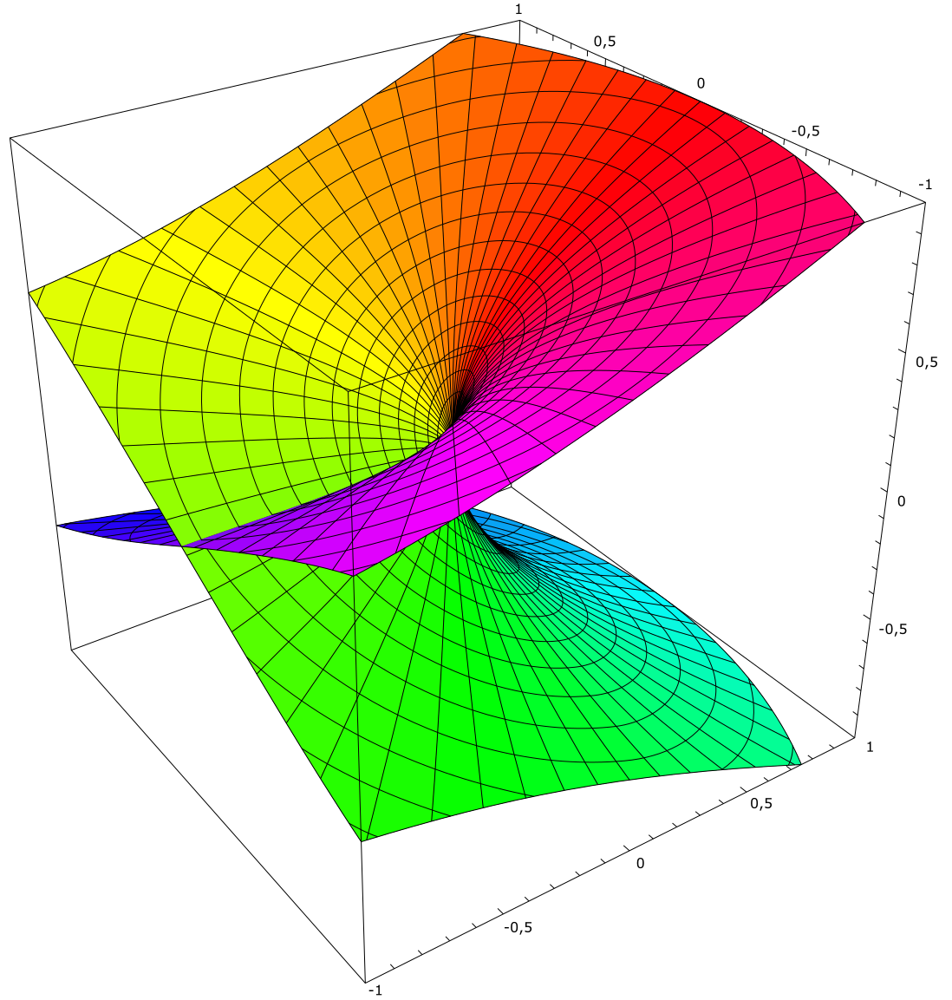

# Riemann Surfaces and Multi-Valued Functions

This is a way of graphing a function with complex inputs and outputs.
It is especially useful for multi-valued functions.
E.g. ∜16 = 2 **and** -2.
If you believe in imaginary numbers, it **also** equals 2𝓲 and -2𝓲.

## Terminology

For a given 𝒛 there can be multiple values for 𝒘.
For a given 𝒘 there can be only one 𝒛.
E.g. 𝒛=𝒘².

## Try It Yourself!

https://tradeideasphilip.github.io/riemann-surfaces/

This is an interactive program.
Use the mouse to move the 𝒛 value.
The 𝒘 values will update automatically.
Click to save the point and continue your path.
Hold the mouse button down to record your entire path, without any preview.

(On a touch device you can just touch to add the next point.
Currently there is no preview or drag option unless you use a mouse.)

Use the dropdown list to pick a function to graph.

### Square Root

𝒛=𝒘².
I started here because it’s the easiest way to explain multi-valued functions to someone who hasn’t seen them before.

Make a circle _all the way_ around the branch point, and the two solutions will each go _half way_ around the branch point, in the same direction.
Make a second circle in the same direction and the two solutions will return to their original places.

### Natural Log

𝒛=𝒆ʷ.
This is just a beautiful example. This result makes the most sense if you think of 𝒛 in polar coordinates.

The distance that 𝒛 is from the origin sets the real part of the result.
As long as the input stays on the positive part of the real axis, this the the normal natural log.

The angle part of 𝒛 sets the imaginary part of the result.
If 𝒛 makes a full circle around the origin in the counter clockwise direction, then you add 2π𝓲 to the result.
If you keep rotating the input in the same direction, the output will keep moving at the same rate and can go on forever.

This program plots 5 of the infinite number of solutions.

### P(𝒛,𝒘)=𝒘³-𝒛·𝒘-2=0

This was the original equation that my professor showed our class.
There are three branch points.
If 𝒛 goes around any one of these points and returns to its initial position, some of the results will swap places.

Try going around multiple branch points.
Or _almost_ going around a branch point.
Or going around a branch point multiple times.

## Alternate View

This image from Wikipedia is a common way to show a Riemann surface, like the one created by 𝒛=𝒘².

𝒛 is not just a number on the complex plane.
𝒛 is a point on this structure which was made by grafting two complex planes together.
𝒛 has to make **two** complete rotations around the point in the center (where all the grid lines meet) before it gets back to the same place on this surface.

That point in the center is often called a "branch point."
It was called a "bad" point in my original TCL code.
This program draws these points as brown dots.

Each position on this Riemann surface maps to exactly one value of 𝒘.

There is nothing special about the ray where the green and purple overlap.
This is just an artifact of how someone chose to draw this surface.
You could slide that intersection somewhere else and the picture would mean the same thing.
The advantage of my program over a picture like this one is that my program shows the total symmetry of the problem.

## History

I recreated something I did in school.
https://www.trade-ideas.com/home/phil/loops/
That code doesn’t want to run any more, so I redid it in JavaScript (TypeScript).

This saved my butt back in grad school. I was having trouble in complex analysis class. The rest of the students were all math majors, and had a fulltime job. But I took one of my professor’s handouts and turned it into an interactive demo and I got a lot of extra credit.

I wish I had saved that handout.
There were no drawings, no colors, just a page full of numbers.

I was initially upset because I couldn’t get my answers to match the professor’s handout. My professor wasn’t the slightest bit concerned. It turns out he made a mistake in his version. No one had ever noticed until I created my interactive demo!

## Keywords

- Riemann surface
- Roots of complex equations
- Analytic continuation
- Multi valued functions
- Complex analysis
- Graphing complex functions
- Branch point
